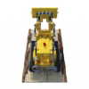
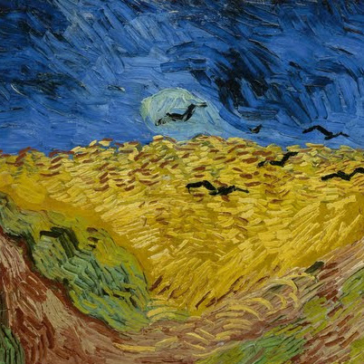
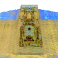
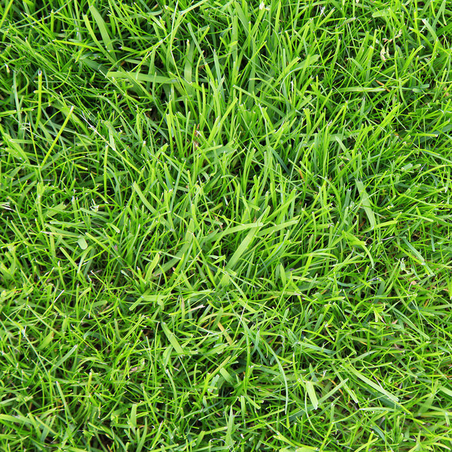
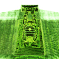

# Style NeRF

An extension of [NeRF](https://arxiv.org/pdf/2003.08934.pdf) (Neural Radiance Fields) to apply 3D style transfer using pytorch ([pytorch-lightning](https://github.com/PyTorchLightning/pytorch-lightning)). The [Neural Style algorithm](https://arxiv.org/abs/1508.06576) is based on the loss network proposed by Leon A. Gatys, Alexander S. Ecker and Matthias Bethge.

Our implementation is composed of two stages:
* Stage 1 - learn a volumetric representation for a scene (standard NeRF)
* Stage 2 - apply the style, extracted from a styling image, to the represention

This approach takes advantage of the way that NeRF isolates the scene's density in a 'head' of the model which is seperate from the 'head' of the model that generates the view dependent color. Stage 1 is used to tune the parts of the model which describe the scene's density (the geometry of the object). Stage 2 freezes those layers and slowly updates the color generating layers based on a combined content and style loss.

## Software

* Clone this repo by `git clone --recursive https://github.com/Jake-Jay/StyleNeRF_pl`
* Python>=3.6 (installation via [anaconda](https://www.anaconda.com/distribution/) is recommended, use `conda create -n nerf_pl python=3.6` to create a conda environment and activate it by `conda activate nerf_pl`)
* Python libraries
    * Install core requirements by `pip install -r requirements.txt`
    * Install `torchsearchsorted` by `cd torchsearchsorted` then `pip install .`

## Data

Download `nerf_synthetic.zip` from [here](https://drive.google.com/drive/folders/128yBriW1IG_3NJ5Rp7APSTZsJqdJdfc1).


## Training

**Stage 1 (density stage):**
```
python train.py \
    --root_dir $ROOT_DIR --dataset_name blender \
    --N_importance 64 --N_samples 64 --noise_std 0 --lr 5e-4 \
    --lr_scheduler cosine --img_wh 100 100 --num_epochs 20\
    --exp_name lego --stage density
```
Where:
* `$ROOT_DIR` is the path to the `<dataset_dir>/lego/`


**Stage 2 (style stage):**
```
python train.py \
    --root_dir $ROOT_DIR --dataset_name blender \
    --N_importance 64 --N_samples 64 --noise_std 0  --lr 5e-4 \
    --lr_scheduler cosine --img_wh 100 100  --num_epochs 20 \
    --exp_name lego_style --stage style \
    --ckpt_path "$DENSITY_CKPT" --style_img "$STYLE_IMG"
```
Where:
* `$DENSITY_CKPT` is the checkpoint generated in stage 1.
* `$STYLE_IMG` is the path to your styling image

## Evaluation

```
python eval.py \
   --root_dir $ROOT_DIR \
   --dataset_name blender --scene_name $SCENE_NAME \
   --img_wh 100 100 --N_importance 64 \
   --ckpt_path "$STYLE_CKPT"
```

## Results

Given a sparce set of images of a Lego truck, NeRF can generate a volumetric representation of the scene. This representation can be used to generate novel views of the scene facilitating the creation of continuous three dimensional views of an object such as the one seen below.




This representation can then be manipulated using a styling image.


Styling Image             |  Styled 3D Output
:-------------------------:|:-------------------------:
  |  
 | 


## Credits
This is a work in progress. Contributors are [Jake Pencharz](https://github.com/Jake-Jay/) and 
[Abdullah Hayran](https://github.com/abhayran).


* [Official NeRF Implementation](https://github.com/bmild/nerf)
* [Pytorch Lightning Implentation](https://github.com/kwea123/nerf_pl) - this was used as the baseline for our implementation.